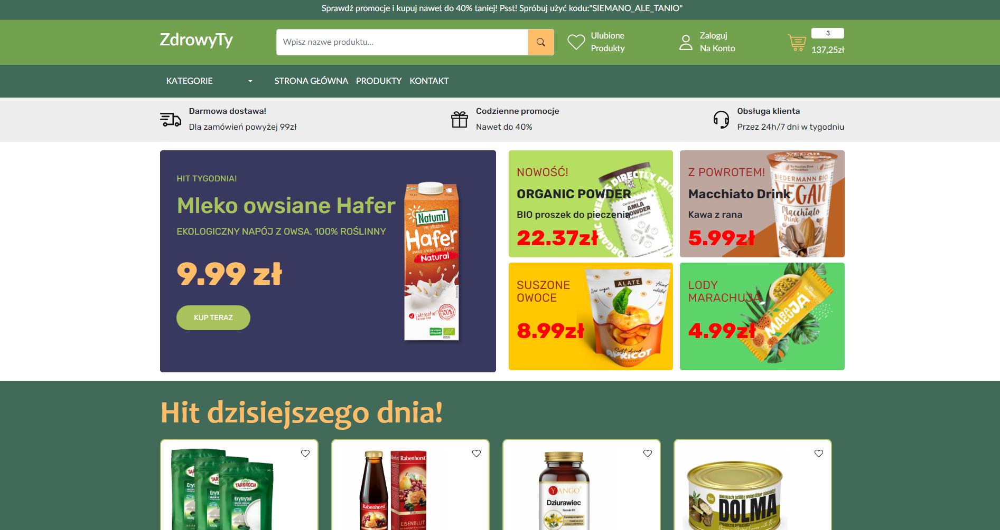
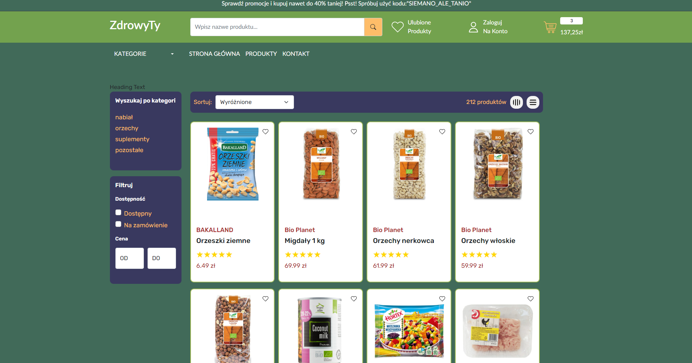
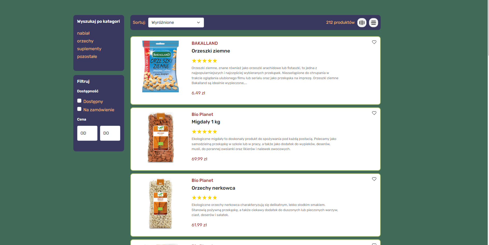

# Project Name

ZdrowyTy

## Table of Contents

- [General Info](#general-information)
- [Technologies Used](#technologies-used)
- [Features](#features)
- [Screenshots](#screenshots)
- [Setup](#setup)
- [Usage](#usage)
- [Project Status](#project-status)
- [Room for Improvement](#room-for-improvement)
- [Acknowledgements](#acknowledgements)
- [Contact](#contact)
<!-- * [License](#license) -->

## General Information

- Provide general information about your project here.
  ZdrowyTy to strona internetowa przedstawiajaca sklep internetowy, ktory trudni sie sprzedazą zdrowej zywnosci.
  Sklep powstal aby poprawic moje umiejetnosci pracy z bootstrapem oraz reactem. Jezeli postaram sie wlozyc w niego wiecej pracy to
  uda mi sie go przedstawic jako projekt komerycyjny na moja prace licencjacka.
  Pomysl ze sklepem powstal jako jedno z moich marzen czyli prowadzenie sklepu internetowego

## Technologies Used

- Tech 1 - react
- Tech 2 - bootstrap
- Tech 3 - redux

## Features

List the ready features here:

- przejrzysta strona
- ladnie wyglada

## Screenshots

<!-- If you have screenshots you'd like to share, include them here. -->

## Setup

--npm i react
--npm install react react-dom
--npm install redux
--npm i bootstrap

w skrócie npm install, ale chciałem przedstawić również pojedyncze komendy

## Usage

Aplikacja stworzona w reacie, po zainstalowaniu --npm start, przeniesie nas na localhosta:3000

## Project Status

Project is: _in progress_ . Potrzeba wiecej czasu zeby poprawic backend. Mam swiadomosc ze poswiecilem mu za malo czasu.

## Room for Improvement

Room for improvement:

- dodanie wiecej produktow
- podlaczenie pod mongodb

To do:

- koszyk
- panel pokaż produkt

## Acknowledgements

--yt/https://www.youtube.com/watch?v=Qz7swLxNS0Y&t=1837s

## Contact

Created by Mikolaj Barczynski

<!-- Optional -->
<!-- ## License -->
<!-- This project is open source and available under the [... License](). -->

<!-- You don't have to include all sections - just the one's relevant to your project -->
